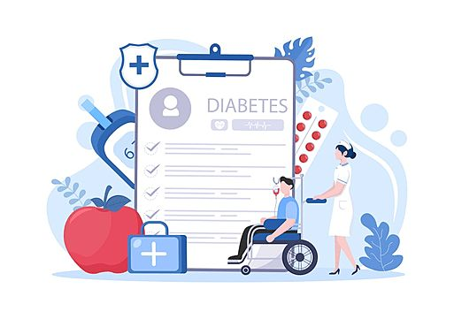

#  Diabetes Prediction Project

---

## Business Understanding

Stakeholder Identification:

The primary stakeholders for this diabetes prediction project include healthcare providers, public health organizations, and individual patients concerned about their diabetes risk. Healthcare providers such as primary care physicians, endocrinologists, and nurses are directly involved in diagnosing and managing diabetes. Public health organizations, including government agencies and non-profit organizations, focus on population health and preventive measures. Patients with diabetes or at risk of developing diabetes are also key stakeholders, as they benefit from early detection and personalized care.

Project Value:

This project addresses the critical public health issue of diabetes by leveraging machine learning techniques to predict the onset of diabetes based on health indicators. The value proposition includes:

Early Detection: Identifying individuals at high risk of developing diabetes allows for early interventions and lifestyle modifications.
Personalized Care: Tailoring healthcare interventions based on individual risk profiles improves patient outcomes and quality of life.
Cost Savings: Preventing or delaying diabetes-related complications reduces healthcare costs and improves resource allocation.
Data-Driven Insights: Providing actionable insights for healthcare providers and public health organizations to develop targeted interventions and policies.
How Stakeholders Will Use the Project:

Healthcare providers will use the predictive model to identify at-risk individuals, personalize treatment plans, and improve diabetes management. Public health organizations can utilize the insights to implement targeted prevention programs and policies. Patients can assess their diabetes risk using the web-based application, empowering them to make informed decisions about their health and lifestyle. Overall, the project aims to contribute to better health outcomes, cost savings, and improved healthcare access for individuals at risk of diabetes.

---

## Problem Statement

The rising prevalence of diabetes poses significant public health challenges worldwide. Early detection and management of diabetes can lead to substantial reductions in complications such as heart disease, stroke, kidney failure, and blindness. This project aims to use machine learning techniques to predict the onset of diabetes based on various health indicators, enabling earlier interventions.

---

## Objectives

1. Predictive Modeling: To predict the binary outcome (presence or absence of diabetes).
2. Feature Importance: Identify which factors are most predictive of diabetes.
3. Risk Profiling: Classify individuals into different risk categories based on their predicted probability of having diabetes.

---

## Models for Classification

1. Logistic Regression: A good baseline for binary classification problems.
2. Random Forest Classifier: Effective for handling a mix of numerical and categorical variables and capturing complex interactions between variables.
3. Gradient Boosting Machines (GBM): Known for high performance in terms of accuracy.
4. Support Vector Machines (SVM): Effective in high-dimensional spaces.
5. Neural Networks: Can capture complex non-linear relationships.

---

## Deployment Methods

1. Web Application: A user-friendly interface for clinicians or individuals to input health data and receive risk assessments.
2. API Integration: Integration with healthcare databases for real-time risk assessment as new data becomes available.

---

### Evaluation Metrics

1. Accuracy: Proportion of total predictions that were correct.
2. Precision and Recall: Particularly in medical diagnostics, minimizing false negatives (maximizing recall) might be more critical.
3. ROC-AUC: Measure of the ability of the classifier to distinguish between classes.

---

### Success Metrics

1. Adoption by Healthcare Providers: Measured by the number of healthcare providers utilizing the predictive tool.
2. Improvement in Patient Outcomes: Reduction in the incidence of diabetes through early intervention based on the model's predictions.

This framework provides a structured approach to analyzing the dataset and developing a solution that can be iteratively refined based on model performance and feedback from end-users.

---

## Data Understanding

This dataset contains 3 files :

> *diabetes 012 health indicators BRFSS2015.csv* is a clean dataset of 253,680 survey responses to the CDC's BRFSS2015. The target variable Diabetes_012 has 3 classes. 0 is for no diabetes or only during pregnancy, 1 is for prediabetes, and 2 is for diabetes. There is class imbalance in this dataset. This dataset has 21 feature variables

> *diabetes binary 5050split health indicators _ BRFSS2015.csv* is a clean dataset of 70,692 survey responses to the CDC's BRFSS2015. It has an equal 50-50 split of respondents with no diabetes and with either prediabetes or diabetes. The target variable Diabetes_binary has 2 classes. 0 is for no diabetes, and 1 is for prediabetes or diabetes. This dataset has 21 feature variables and is balanced.

> *diabetes binary health indicators BRFSS2015.csv* is a clean dataset of 253,680 survey responses to the CDC's BRFSS2015. The target variable Diabetes_binary has 2 classes. 0 is for no diabetes, and 1 is for prediabetes or diabetes. This dataset has 21 feature variables and is not balanced.

The *diabetes 012 health indicators BRFSS2015.csv* dataset is rich with both demographic and health-related variables, which can be instrumental in predicting diabetes and associated risk factors.

The dataset contains 253,680 entries with 22 attributes. Here’s a brief description of each column:

- *Diabetes_012:* The target variable Diabetes_012 has 3 classes. 0 is for no diabetes or only during pregnancy, 1 is for prediabetes, and 2 is for diabetes. 
- HighBP: Indicator for high blood pressure.
- HighChol: Indicator for high cholesterol.
- CholCheck: Indicates if cholesterol levels have been checked.
- BMI: Body Mass Index.
- Smoker: Indicates if the person is a smoker.
- Stroke: Indicates if the person has had a stroke.
- HeartDiseaseorAttack: Indicates presence of heart disease or a previous heart attack.
- PhysActivity: Indicates if the person engages in physical activity.
- Fruits: Consumption of fruits.
- Veggies: Consumption of vegetables.
- HvyAlcoholConsump: Indicates heavy alcohol consumption.
- AnyHealthcare: Access to healthcare.
- NoDocbcCost: Indicates no doctor visit due to cost.
- GenHlth: General health condition.
- MentHlth: Mental health condition days in past 30 days.
- PhysHlth: Physical health condition days in past 30 days.
- DiffWalk: Difficulty in walking.
- Sex: Gender of the person.
- Age: Age category.
- Education: Level of education.
- Income: Income categories.